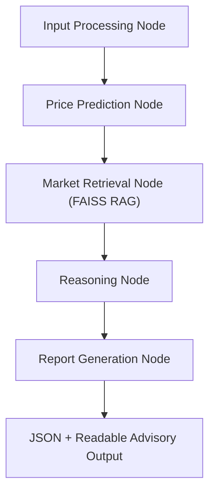

# AI Real Estate Advisory Assistant

This project upgrades the original property price predictor into an agentic advisory system that keeps the existing trained ML models and adds retrieval, reasoning, evaluation, and structured reporting.

## Capabilities

- Predicts property prices using the existing `joblib` models
- Accepts structured property inputs including budget and intent
- Retrieves grounded market context from a FAISS-backed local knowledge base
- Runs an explicit LangGraph workflow with shared state
- Produces advisory output in readable markdown and JSON
- Includes evaluation scripts with MAE, RMSE, and R2
- Uses fallback behavior when grounded data is unavailable

## Architecture

### Folder Structure

```text
PropertyPricePrediction/
├── artifacts/
│   ├── linear_regression.joblib
│   └── random_forest.joblib
├── data/
│   ├── data.csv
│   └── market_knowledge.json
├── src/
│   ├── app.py
│   ├── evaluate.py
│   ├── train.py
│   └── advisor/
│       ├── agent.py
│       ├── config.py
│       ├── knowledge_base.py
│       ├── model_service.py
│       ├── reasoning.py
│       ├── reporting.py
│       ├── retriever.py
│       ├── schemas.py
│       └── ui/
│           └── streamlit_app.py
├── .env.example
├── requirements.txt
└── README.md
```

### LangGraph Workflow



### Data Flow

1. The UI collects structured property input.
2. `PropertyInput` validates and normalizes fields into shared agent state.
3. The existing saved ML model predicts price from mapped features.
4. The retriever searches the local market knowledge base using FAISS.
5. The reasoning layer compares model price with retrieved market comparables, budget, appreciation, and rental yield.
6. The reporting layer emits a structured advisory report and readable summary.

## Responsible AI Guardrails

- Retrieval-grounded market reasoning only
- Deterministic fallback when no relevant documents are found
- Explicit low-confidence note when retrieval returns no evidence
- No unsupported guessing outside the local knowledge base

## Setup

1. Create and activate a virtual environment.
2. Install dependencies:

```bash
pip install -r requirements.txt
```

3. Copy environment variables:

```bash
cp .env.example .env
```

## Run

### Start the advisory UI

```bash
streamlit run src/app.py
```

### Re-train models

This preserves the same model family and artifact names.

```bash
python3 src/train.py
```

### Evaluate models

```bash
python3 src/evaluate.py
```

Evaluation output is written to `artifacts/evaluation.json`.

## Sample Input

```json
{
  "city": "Ames",
  "area": "CollgCr",
  "property_type": "flat",
  "size_sqft": 1500,
  "bhk": 3,
  "bathrooms": 2,
  "year_built": 2010,
  "amenities": ["parking", "security"],
  "budget": 250000,
  "user_intent": "investment"
}
```

## Sample Output

```json
{
  "predicted_price": 223540.0,
  "selected_model": "random_forest",
  "market_trend_summary": "CollgCr, Ames: Steady end-user demand, low distress inventory, and moderate new supply support resilient pricing for mid-sized homes. Avg price Rs 150/sqft, appreciation 6.8%, rental yield 3.9%, risk low.",
  "investment_score": 72,
  "risk_level": "Medium",
  "recommendation": "Consider buy",
  "justification": "Predicted price is Rs 223,540 against an estimated comparable value of Rs 225,000, creating a valuation gap of -0.65%. Retrieved locations show average appreciation of 6.8% and rental yield of 3.9%. The property appears undervalued versus retrieved market comparables. Investment focus prioritizes appreciation and rental yield.",
  "valuation_gap_pct": -0.65,
  "budget_fit": "within budget",
  "comparable_market_price": 225000.0,
  "user_intent": "investment",
  "confidence_note": "Grounded on retrieved market documents only. If local market conditions changed recently, refresh the knowledge base before relying on this advisory output."
}
```

## Notes

- The existing ML artifacts in `artifacts/` are reused directly.
- The RAG store currently uses a local JSON knowledge base and FAISS retrieval.
- For production deployment, replace the sample market knowledge file with regularly refreshed market documents and connect the reasoning layer to curated data pipelines.
